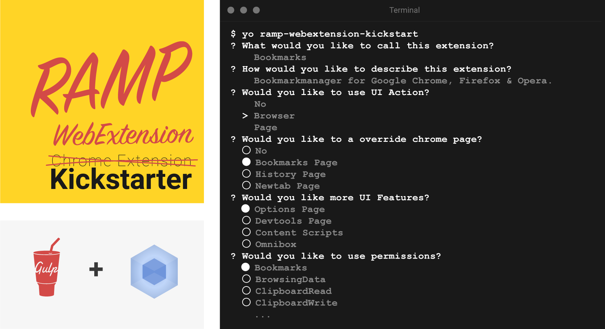

 

The **RAMP WebExtensions Generator** is an advanced Browser Extensions generator that creates everything you need to get started with Browser Extensions development. Based on [generator-chrome-extension-kickstart](https://github.com/HaNdTriX/generator-chrome-extension-kickstart) by [HaNdTriX](https://github.com/HaNdTriX).

This generator uses:

* [gulp.js](http://gulpjs.com/)
* [webpack](http://webpack.github.io/docs/)
* [Babel.js](https://babeljs.io/)

## Features

* ES2015
* Modules (ES2015, CommonJS, AMD)
* Multi browser support ([chrome](https://developer.chrome.com/extensions), [firefox](https://wiki.mozilla.org/WebExtensions), [opera](https://dev.opera.com/extensions/), [edge](https://docs.microsoft.com/en-us/microsoft-edge/extensions))
* Vendor prefixed manifest keys
* Sourcemaps
* Linting
* CSS, Sass, Less
* Environment variables
* Image optimization
* Livereload
* Packaging
* Version management

## Install

	$ npm install -g yo ramp-webextensions-generator

## Getting Started

- First make a new directory, and `cd` into it: `mkdir my-new-chrome-extension && cd $_`
- Run: `yo ramp-webextension-kickstart`.

## Options

* `--skip-install`

  Skips the automatic execution of `npm` after
  scaffolding has finished.

## Documentation

Check out the [documentation](DOCUMENTATION.md)

## Contribute

See the [contributing docs](https://github.com/yeoman/yeoman/blob/master/contributing.md)

## License

[MIT](LICENSE)
